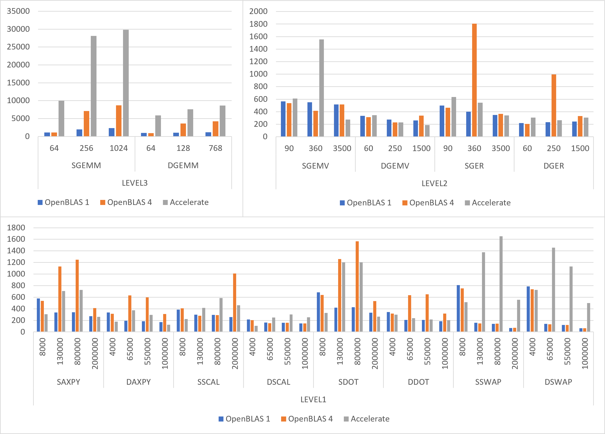

# Apple Silicon AMX SGEMM
Use AMX to implement sgemm (Single GEneral Matrix Mutiplication).

## benchmark
The benchmark is ported from
https://github.com/keichi/m1-benchmarks

It is used to test the `sgemm` (single general matrix multiplication) on m1 mac by using Accelerate Framework, OpenBLAS, Eigen (OpenMP) and Metal (the GPU on m1). The origin result of keichi's work is in `benchmark/old_result`, and to rebuild it, you should checkout to *Init*.

I remove the Eigen sgemm and add my `amx_sgemm.h` sgemm. The result is:

## dougallj
`aarch64_amx.py` is from
https://gist.github.com/dougallj/7a75a3be1ec69ca550e7c36dc75e0d6f

This file discribe the AMX accelerator in Apple Silicon and is used for IDA pro plugin.

`amx.h`, `simulator.h` and `hwtest.c` are from https://gist.github.com/dougallj/7cba721da1a94da725ee37c1e9cd1f21

These files use the asm to access the amx instructions, and simulator is used to compare the result.

Thanks for the `amx.h` and `aarch64_amx.py`, I use them to access the amx and implement `sgemm` successfully. 

## src
This fold is mainly about my code for testing amx operations and use the amx implemention of sgemm in file `amx_sgemm.h`.

# Compare OpenBLAS and Accelerate

||||OpenBLAS|OpenBLAS|Accelerate|
|---|---|---|---|---|---|
|||OpenMP|1|4|1|
|||SIZE|MFLOPS|MFLOPS|MFLOPS|
|LEVEL3|SGEMM|64|1141.20|1150.40|9988.30|
||SGEMM|256|1950.09|7142.02|28091.44|
||SGEMM|1024|2343.98|8702.92|29798.21|
||DGEMM|64|1002.30|959.96|5907.80|
||DGEMM|128|1077.31|3618.08|7590.15|
||DGEMM|768|1162.62|4258.71|8620.64|
|||||||
|LEVEL2|SGEMV|90|564.21|537.07|611.26|
||SGEMV|360|552.00|415.31|1555.84|
||SGEMV|3500|517.18|516.29|276.48|
||DGEMV|60|335.77|315.07|344.47|
||DGEMV|250|275.66|231.34|231.35|
||DGEMV|1500|262.17|339.45|188.05|
||SGER|90|500.17|465.47|633.65|
||SGER|360|399.92|1807.82|544.16|
||SGER|3500|348.92|365.13|342.03|
||DGER|60|220.08|206.23|308.09|
||DGER|250|232.97|995.55|263.96|
||DGER|1500|243.28|332.19|305.45|
|||||||
|LEVEL1|SAXPY|8000|578.26|537.70|304.74|
||SAXPY|130000|334.90|1132.40|708.71|
||SAXPY|800000|338.48|1247.35|726.05|
||SAXPY|2000000|273.71|412.19|261.03|
||DAXPY|4000|335.91|314.40|178.68|
||DAXPY|65000|191.44|629.90|375.78|
||DAXPY|550000|185.47|598.17|293.72|
||DAXPY|1000000|168.83|308.06|125.50|
||SSCAL|8000|385.26|409.00|224.53|
||SSCAL|130000|299.33|279.85|417.54|
||SSCAL|800000|295.91|292.54|585.64|
||SSCAL|2000000|257.48|1010.58|461.59|
||DSCAL|4000|213.57|203.54|107.32|
||DSCAL|65000|163.22|150.36|249.95|
||DSCAL|550000|160.29|159.00|303.76|
||DSCAL|1000000|147.60|148.35|252.60|
||SDOT|8000|683.86|638.70|330.72|
||SDOT|130000|418.74|1261.05|1202.74|
||SDOT|800000|428.33|1565.97|1201.26|
||SDOT|2000000|330.98|532.22|263.58|
||DDOT|4000|342.93|318.95|300.32|
||DDOT|65000|207.32|634.66|239.31|
||DDOT|550000|207.55|651.85|215.48|
||DDOT|1000000|184.21|315.62|202.20|
||SSWAP|8000|809.67|753.78|516.04|
||SSWAP|130000|157.31|147.72|1377.55|
||SSWAP|800000|141.11|142.05|1654.37|
||SSWAP|2000000|67.88|69.86|554.76|
||DSWAP|4000|787.49|735.44|725.72|
||DSWAP|65000|139.82|131.24|1454.10|
||DSWAP|550000|119.96|120.83|1131.22|
||DSWAP|1000000|65.38|64.08|500.13|
