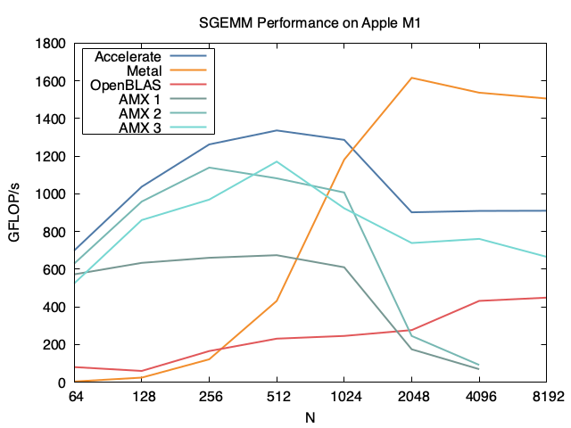

# Apple Silicon AMX SGEMM
Use AMX to implement sgemm (Single GEneral Matrix Mutiplication).

## benchmark
The benchmark is ported from
https://github.com/keichi/m1-benchmarks

It is used to test the `sgemm` (single general matrix multiplication) on m1 mac by using Accelerate Framework, OpenBLAS, Eigen (OpenMP) and Metal (the GPU on m1). The origin result of keichi's work is in `benchmark/old_result`, and to rebuild it, you should checkout to *Init*.

I remove the Eigen sgemm and add my `amx_sgemm.h` sgemm. The result is:

## dougallj
`aarch64_amx.py` is from
https://gist.github.com/dougallj/7a75a3be1ec69ca550e7c36dc75e0d6f

This file discribe the AMX accelerator in Apple Silicon and is used for IDA pro plugin.

`amx.h`, `simulator.h` and `hwtest.c` is from https://gist.github.com/dougallj/7cba721da1a94da725ee37c1e9cd1f21

These files use the asm to access the amx instructions, and simulator is used to compare the result.

Thanks for the `amx.h` and `aarch64_amx.py`, I use them to access the amx and implement `sgemm` successfully. 

## src
This fold is mainly about my code for testing amx operations and use the amx implemention of sgemm in file `amx_sgemm.h`.
